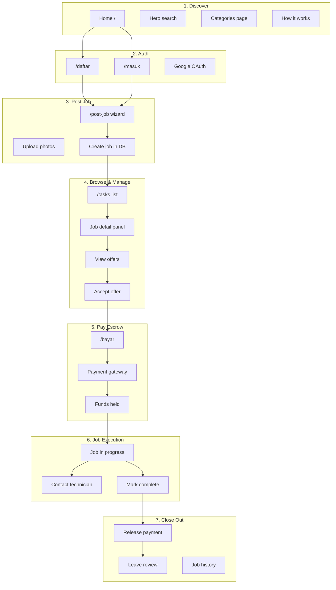

# KerjaIn — Completion Roadmap

A full checklist to take KerjaIn from **working prototype** to **production-ready marketplace**. Organized by end-to-end pipeline flows for **customers (pemilik pekerjaan)** and **technicians (tukang)**.

**Legend:** ✅ Done (shipped) · 🟡 Partial · 🔧 Backend only (API in Kerjain-Backend, frontend not wired) · ❌ Not started

*Last updated: June 2026 — regenerate as features ship.*

---

## Architecture (current — do not regress)

| Repo | Role | Production |
|------|------|------------|
| **Kerjain-Backend** | Source of truth for API | `https://api.kerjaindonesia.com` |
| **KerjaIn-frontend** | React/Vite UI only | `https://www.kerjaindonesia.com` (Vercel) |

**Rules for new work:**

- Add routes and business logic only in **Kerjain-Backend** (`src/routes/`, `src/utils/`).
- Frontend calls API via `src/lib/api.ts` with `credentials: "include"` (HttpOnly cookies). **Do not** store JWTs in `localStorage`.
- Document new API behavior in `Kerjain-Backend/docs/` per `feature-documentation.md`.
- `KerjaIn-frontend/backend/` is **legacy** — do not extend; remove in a future cleanup PR.
- DB migrations: moving to `Kerjain-Backend/supabase/migrations/` (Phase 1). Until then, one migration lives in frontend repo.

**Do not merge the old `map` git branch wholesale** — it predates this structure and embeds a duplicate backend.

---

## Current State (as of June 2026)

| Layer | Status |
|-------|--------|
| Frontend UI | ✅ Major pages built (Figma export, Indonesian localization) |
| API | ✅ **Kerjain-Backend** — auth, jobs, offers, technicians, payments, upload, reviews, admin, app config |
| Supabase DB | 🟡 Core tables exist; `reviews` / `app_settings` / job coordinates may need migrations applied |
| Auth | ✅ Email + Google OAuth; HttpOnly cookie sessions; `vercel.json` SPA rewrites |
| Payments | 🟡 Simulated — no real gateway (Midtrans/Xendit) |
| File uploads | 🔧 `POST /api/upload/job-photo` on backend; PostJob UI still uses placeholder photo strings |
| Messaging | ❌ No in-app chat |
| Reviews | 🔧 API mounted; DB table + frontend UI ❌ |
| Notifications | ❌ UI badge only, no backend |
| Maps | ❌ SVG placeholder on `/tasks` (real map is Phase 3, not the old `map` branch) |
| Admin | 🔧 API mounted; no admin UI |
| Deploy | ✅ Vercel (frontend) + Vercel/Railway host (backend) + custom domains |

---

## Customer Pipeline (Pemilik Pekerjaan)



### Step-by-step checklist — Customer

#### 1. Discover & land
| # | Task | Status | Notes |
|---|------|--------|-------|
| 1.1 | Home page marketing content | ✅ | Static content, carousel, trust sections |
| 1.2 | Hero search → navigate to `/tasks` with query | ❌ | Search input is local-only |
| 1.3 | Service directory links | ❌ | All `href="#"` |
| 1.4 | Wire `/categories` route (or remove) | ❌ | Page exists but unrouted; English/US copy |
| 1.5 | Localize `Categories.tsx` to Indonesian + Jakarta | ❌ | |
| 1.6 | Fix HowItWorks CTA → `/post-job` not `/tasks` | ❌ | |
| 1.7 | Footer links (Tentang Kami, FAQ, Syarat, etc.) | ❌ | All `href="#"` |
| 1.8 | SEO: meta tags, Open Graph, sitemap | ❌ | `index.html` has `noindex` |

#### 2. Register / login
| # | Task | Status | Notes |
|---|------|--------|-------|
| 2.1 | Email register (`POST /api/auth/register`) | ✅ | Role `user`; no session until email verified |
| 2.2 | Email login (`POST /api/auth/login`) | ✅ | Sets HttpOnly cookies |
| 2.3 | Cookie session + refresh | ✅ | `credentials: "include"`; not `localStorage` JWT |
| 2.4 | Google OAuth | ✅ | `/auth/google` → `/auth/callback?oauth=success` |
| 2.5 | Facebook OAuth | ❌ | Disabled on backend (`oauth_unavailable`) |
| 2.6 | Apple OAuth | — | Removed — not supported |
| 2.7 | Forgot password / reset email | ✅ | `/lupa-sandi`, `/atur-ulang-sandi` |
| 2.8 | Email verification | ✅ | `/verifikasi-email`; resend from `/akun` |
| 2.9 | Show logged-in state in header (`Root.tsx`) | ✅ | Avatar, name, account link |
| 2.10 | User profile / account settings (`/akun`) | ✅ | Profile, change password, verification |
| 2.11 | Logout from header | ✅ | Clears cookies via `POST /api/auth/logout` |
| 2.12 | Phone verification on account | ❌ | `phone` field on profile API exists; no OTP flow |

#### 3. Post a job
| # | Task | Status | Notes |
|---|------|--------|-------|
| 3.1 | 6-step wizard UI | ✅ | Layanan → Deskripsi → Lokasi → Waktu → Anggaran → Tinjau |
| 3.2 | Auth guard on `/post-job` | ✅ | Redirects to `/masuk` |
| 3.3 | Persist job to DB (`POST /api/jobs`) | ✅ | Kerjain-Backend |
| 3.4 | Real photo upload to Supabase Storage | 🔧 | API `POST /api/upload/job-photo`; UI still placeholder strings |
| 3.5 | Image preview + delete before submit | ❌ | |
| 3.6 | Geocode address → lat/lng on job | 🔧 | Backend geocodes on create; needs DB columns + map UI (Phase 3) |
| 3.7 | Success screen → link to live job on `/tasks?id=` | 🟡 | Shows ticket but no deep link |
| 3.8 | Share job link (copy/WhatsApp) | 🟡 | Copy UI exists, shares mock ID |
| 3.9 | Customer "My Jobs" dashboard | 🔧 | `GET /api/jobs/mine` exists; no `/pekerjaan-saya` page |
| 3.10 | Cancel open job | 🔧 | `POST /api/jobs/:id/cancel` on backend; no frontend UI |
| 3.11 | Validation error messages from API | 🟡 | Backend returns `details`; frontend shows generic error |

#### 4. Browse jobs & receive offers
| # | Task | Status | Notes |
|---|------|--------|-------|
| 4.1 | Job list from API (`GET /api/jobs`) | ✅ | |
| 4.2 | Search filter (title) | ✅ | Client + server |
| 4.3 | Location / price / sort filters | ❌ | UI only, no logic |
| 4.4 | Real map with job pins | ❌ | SVG placeholder — Phase 3 |
| 4.5 | Job detail panel | ✅ | Detail / Penawaran / Pemilik tabs |
| 4.6 | Fetch offers (`GET /api/offers/job/:id`) | ✅ | |
| 4.7 | Accept offer (`POST /api/offers/:id/accept`) | ✅ | Job → `assigned` |
| 4.8 | Real-time new offer notifications | ❌ | No Supabase Realtime / push |
| 4.9 | Compare offers side-by-side | ❌ | |
| 4.10 | View technician profile before accepting | 🔧 | `GET /api/technicians/:id/public` exists; UI not wired |
| 4.11 | Customer "My Jobs" view (not all open jobs) | ❌ | `/tasks` shows marketplace open jobs |

#### 5. Pay (escrow)
| # | Task | Status | Notes |
|---|------|--------|-------|
| 5.1 | Payment page UI (e-wallet, VA, card) | ✅ | |
| 5.2 | Auth guard + `?jobId=&offerId=` params | ✅ | |
| 5.3 | Create payment (`POST /api/payments`) | ✅ | Simulated |
| 5.4 | Integrate real gateway (Midtrans / Xendit) | ❌ | Phase 2 |
| 5.5 | Webhook for payment confirmation | ❌ | Phase 2 |
| 5.6 | VA confirm (`POST /api/payments/:id/confirm`) | 🔧 | API exists; UI doesn't call it |
| 5.7 | Credit card form → real charge | ❌ | `setTimeout` mock |
| 5.8 | Payment receipt / invoice PDF | ❌ | |
| 5.9 | Refund / dispute flow | ❌ | |
| 5.10 | Order summary uses live data | 🟡 | Loads from API if params present; sidebar still uses static `JOB` in places |

#### 6. Job in progress
| # | Task | Status | Notes |
|---|------|--------|-------|
| 6.1 | Job status `in_progress` after payment | 🟡 | Backend sets on payment confirm |
| 6.2 | Customer dashboard: active jobs | ❌ | Phase 1 — My Jobs page |
| 6.3 | In-app messaging with technician | ❌ | Phase 4 |
| 6.4 | Schedule / reschedule appointment | ❌ | |
| 6.5 | Photo updates from technician on-site | ❌ | |
| 6.6 | Customer confirms job complete | ❌ | `POST /api/jobs/:id/complete` — Phase 1 backend |
| 6.7 | Auto-release escrow after N days | 🟡 | `escrowReleaseAtFromNow` helper exists; no cron |

#### 7. Reviews & history
| # | Task | Status | Notes |
|---|------|--------|-------|
| 7.1 | `reviews` table in DB | ❌ | Migration in Phase 1; API already mounted |
| 7.2 | Leave star rating + text review | 🔧 | `POST /api/reviews/job/:jobId`; no UI |
| 7.3 | Update technician rating aggregates | 🔧 | `refreshTechnicianRating` in backend; needs DB + reviews |
| 7.4 | Completed jobs history for customer | ❌ | Phase 1 |
| 7.5 | Home page "completed tasks" carousel from real data | ❌ | Static mock |

---

## Technician Pipeline (Tukang)

### Step-by-step checklist — Technician

#### 1. Register as tukang
| # | Task | Status | Notes |
|---|------|--------|-------|
| 1.1 | 5-step wizard UI | ✅ | `/daftar-tukang` |
| 1.2 | Email register with `role: technician` | ✅ | No session until verified; then login |
| 1.3 | Google OAuth for technicians | ✅ | `?role=technician` + resume flow |
| 1.4 | Save `technician_profiles` on submit | ✅ | After authenticated |
| 1.5 | Real KTP + selfie upload to Storage | ❌ | `setTimeout` → placeholder strings |
| 1.6 | NIK validation (16 digit) | ❌ | |
| 1.7 | Tarif selection UI | 🟡 | Options defined; selection incomplete |
| 1.8 | Phone OTP verification | ❌ | |
| 1.9 | Auth guard if already logged in | 🟡 | Partial via resume query params |

#### 2. Verification
| # | Task | Status | Notes |
|---|------|--------|-------|
| 2.1 | `verified` flag on profile | ✅ | Column exists |
| 2.2 | Admin panel to review KTP | 🔧 | `GET/PATCH /api/admin/technicians*`; no UI |
| 2.3 | Email when verified | 🔧 | `sendTechnicianVerifiedEmail` on backend |
| 2.4 | Block quoting until verified (policy) | 🔧 | `app_settings.requireVerifiedToQuote`; no UI enforcement |
| 2.5 | Verified badge on dashboard + offers | ❌ | |

#### 3. Browse jobs (Lowongan tab)
| # | Task | Status | Notes |
|---|------|--------|-------|
| 3.1 | Job feed from API | ✅ | Technicians excluded from own jobs |
| 3.2 | Category filter tabs | 🟡 | Partial |
| 3.3 | Area-based filtering | ❌ | |
| 3.4 | Hide jobs already quoted | 🟡 | Local state only — resets on refresh |
| 3.5 | Persist quoted state (`GET /api/offers/mine`) | 🔧 | API exists; dashboard uses mock `MY_OFFERS` |
| 3.6 | Job detail panel | ✅ | |
| 3.7 | Exclude own posted jobs | ✅ | Backend filters on `GET /api/jobs` |

#### 4. Submit quote (Penawaran)
| # | Task | Status | Notes |
|---|------|--------|-------|
| 4.1 | Quote form UI | ✅ | |
| 4.2 | Submit offer (`POST /api/offers/job/:id`) | ✅ | |
| 4.3 | Duplicate offer prevention | ✅ | Unique `(job_id, technician_id)` |
| 4.4 | Edit / withdraw pending offer | ❌ | |
| 4.5 | "Penawaran Saya" tab from API | ❌ | Static mock — Phase 1 |
| 4.6 | Offer status updates (realtime) | ❌ | |

#### 5. Active jobs (Pekerjaan Aktif tab)
| # | Task | Status | Notes |
|---|------|--------|-------|
| 5.1 | List assigned + paid jobs | ❌ | Static `ACTIVE_JOBS` mock |
| 5.2 | `GET /api/jobs/assigned` | ❌ | Phase 1 backend |
| 5.3 | "Hubungi Pelanggan" messaging | ❌ | Phase 4 |
| 5.4 | Navigation to job address (maps link) | ❌ | Phase 3 |
| 5.5 | Mark job complete | ❌ | `POST /api/jobs/:id/complete` — Phase 1 |
| 5.6 | Upload completion photos | ❌ | |

#### 6. Completed & earnings (Selesai tab)
| # | Task | Status | Notes |
|---|------|--------|-------|
| 6.1 | Completed jobs list | ❌ | Static mock |
| 6.2 | Earnings summary | ❌ | Hardcoded |
| 6.3 | Payout to bank account | ❌ | No `payouts` table |
| 6.4 | Download earnings report | ❌ | |
| 6.5 | Update `jobs_completed` counter | ❌ | |

#### 7. Technician profile & reputation
| # | Task | Status | Notes |
|---|------|--------|-------|
| 7.1 | Public technician profile page | 🔧 | API exists; no page |
| 7.2 | Display reviews from customers | 🔧 | `GET /api/reviews/technician/:id`; no UI |
| 7.3 | Edit profile after registration | 🔧 | `POST /api/technicians/profile`; no edit UI |
| 7.4 | Availability calendar | ❌ | |
| 7.5 | Portfolio / past work photos | ❌ | |

---

## Shared / Platform Features

### Database tables still needed

| Table / change | Purpose | Status |
|----------------|---------|--------|
| `reviews` | Ratings per completed job | ❌ migration Phase 1 |
| `app_settings` | Admin toggles (`requireVerifiedToQuote`, etc.) | ❌ migration Phase 1 |
| `jobs.latitude`, `jobs.longitude` | Map pins | ❌ migration Phase 1 (backend code ready) |
| `job-photos` storage bucket | Public job listing photos | ❌ migration Phase 1 |
| `messages` | In-app chat | ❌ Phase 4 |
| `notifications` | In-app + push queue | ❌ Phase 4 |
| `job_status_history` | Audit trail | ❌ |
| `payouts` | Technician withdrawals | ❌ |
| `disputes` | Payment / quality disputes | ❌ |
| `saved_jobs` | Customer bookmarks | ❌ |

Existing migration (frontend repo only): `supabase/migrations/20250624120000_add_auth_tokens_and_email_verified.sql`  
→ copy to Kerjain-Backend in Phase 1.

### Backend API — Kerjain-Backend (source of truth)

| Endpoint | Purpose | Status |
|----------|---------|--------|
| `POST /api/auth/*`, Google OAuth | Auth (cookies) | ✅ |
| `GET /api/jobs`, `GET /api/jobs/mine`, `GET /api/jobs/:id` | Jobs | ✅ |
| `POST /api/jobs` | Create job (geocode + validation) | ✅ |
| `POST /api/jobs/:id/cancel` | Cancel open job | ✅ |
| `POST /api/jobs/:id/complete` | Mark complete | ❌ Phase 1 |
| `GET /api/jobs/assigned` | Technician active jobs | ❌ Phase 1 |
| `PATCH /api/jobs/:id` | Edit job | ❌ |
| `GET/POST /api/offers/*` | Offers | ✅ |
| `DELETE /api/offers/:id` | Withdraw offer | ❌ |
| `POST /api/upload/job-photo` | Job photo upload | ✅ |
| `GET/POST /api/reviews/*` | Reviews | ✅ mounted |
| `GET/PATCH /api/admin/*` | Admin | ✅ mounted |
| `GET /api/app/config` | Public app flags | ✅ |
| `GET /api/technicians/:id/public` | Public tech profile | ✅ |
| `POST /api/payments`, `POST .../confirm` | Payments (simulated) | ✅ |
| `GET/POST /api/messages/:jobId` | Chat | ❌ Phase 4 |
| `GET /api/notifications` | Notifications | ❌ |
| Webhook `/api/webhooks/midtrans` | Payment events | ❌ Phase 2 |

Legacy `KerjaIn-frontend/backend/` — **do not use**; delete in cleanup PR.

### Security & infrastructure

| # | Task | Status |
|---|------|--------|
| S1 | RLS policies (if Supabase client direct) | ❌ Backend uses service role |
| S2 | Rate limiting on auth endpoints | ❌ |
| S3 | Input validation on backend | 🟡 `jobValidation.ts`; expand as needed |
| S4 | CORS for production + preview origins | 🟡 `CORS_ORIGINS` + `FRONTEND_URL` on backend |
| S5 | HTTPS in production | ✅ |
| S6 | Environment separation (staging/prod) | 🟡 Vercel preview + production |
| S7 | Secrets not committed | 🟡 `.env` gitignored; use Vercel env |
| S8 | KTP bucket private + signed URLs | ❌ Upload flow not built |

### Notifications & Realtime

| Feature | Status |
|---------|--------|
| In-app notifications | ❌ Phase 4 |
| Email (Resend) | 🟡 Auth emails; job/payment emails ❌ |
| WhatsApp / SMS | ❌ |
| Supabase Realtime (offers, chat, jobs) | ❌ Phase 4 |

---

## Page-by-Page Status

| Route | Page | Backend wired | Remaining work |
|-------|------|---------------|----------------|
| `/` | Home | ❌ | Wire search, dynamic carousel, fix dead links |
| `/tasks` | Tasks | ✅ | Filters, map (Phase 3), my-jobs link |
| `/post-job` | PostJob | ✅ | Photo upload UI, deep link after submit |
| `/bayar` | Payment | 🟡 | `confirmPayment`, remove static sidebar |
| `/masuk` `/daftar` | Auth | ✅ | Cookie auth + Google OAuth |
| `/daftar-tukang` | TechAuth | ✅ | KTP upload, tarif UI |
| `/dasbor-tukang` | TechDashboard | 🟡 | Wire Penawaran/Aktif/Selesai to API |
| `/how-it-works` | HowItWorks | ❌ | Fix CTA links |
| `/categories` | Categories | ❌ | Route, localize |
| `/pekerjaan-saya` | My Jobs | ❌ | **Phase 1** — new page |
| — | Technician profile | 🔧 | API ready; new page Phase 2 |
| `/admin` | Admin panel | 🔧 | API ready; new page Phase 2 |

---

## Recommended Build Order

### Phase 1 — Core loop MVP (next sprint)

> Customer posts → Technician quotes → Customer accepts → Pays → Job done

**Branches:** `feature/roadmap-phase-1-mvp` on both repos.

| # | Backend (Kerjain-Backend) | Frontend (KerjaIn-frontend) |
|---|---------------------------|-----------------------------|
| 1 | ✅ Add `supabase/migrations/` | — |
| 2 | ✅ `GET /api/jobs/assigned` | — |
| 3 | ✅ `POST /api/jobs/:id/complete` + escrow release | — |
| 4 | — | ✅ Extend `api.ts` (mine, cancel, upload, offers/mine, assigned, complete) |
| 5 | — | ✅ `/pekerjaan-saya` (My Jobs) |
| 6 | — | ✅ PostJob real photo upload |
| 7 | — | ✅ TechDashboard tabs from API |
| 8 | — | ✅ Payment page: `confirmPayment` for VA |
| 9 | — | ✅ Complete job actions (customer + tech) |
| 10 | — | ❌ Remove legacy `backend/` folder (separate cleanup PR) |

**Explicitly out of Phase 1:** maps, Midtrans, admin UI, chat, notifications, merging `map` branch.

### Phase 2 — Trust & money

1. Midtrans or Xendit + webhooks  
2. Reviews UI + ensure `reviews` table live  
3. Public technician profile page  
4. Admin panel UI (`/api/admin/*`)  
5. Broader email notifications  

### Phase 3 — Discovery & growth

1. Real map with job coordinates (fresh implementation)  
2. Categories routed + localized  
3. Search with category + area filters  
4. Home dynamic content  
5. SEO + service/area landing pages  

### Phase 4 — Engagement

1. In-app messaging per job  
2. Supabase Realtime  
3. Push / WhatsApp for urgent jobs  
4. Technician earnings / payouts  

### Phase 5 — Production hardening

1. Error monitoring (Sentry)  
2. Analytics  
3. Rate limiting + security audit  
4. Load testing  

---

## End-to-End Happy Path Test Script

Use after each phase merge to production.

### Customer
1. [ ] Register at `/daftar` with email → verify → login  
2. [ ] Post job at `/post-job` (with real photo — after Phase 1)  
3. [ ] See job on `/pekerjaan-saya` and `/tasks`  
4. [ ] View offers → accept → pay at `/bayar`  
5. [ ] Confirm job complete → leave review (Phase 2 for review UI)  

### Technician
1. [ ] Register at `/daftar-tukang` (OAuth or email)  
2. [ ] Admin verifies KTP (Phase 2 admin UI)  
3. [ ] Quote on Lowongan → see in Penawaran Saya (Phase 1)  
4. [ ] Active job after payment → mark selesai (Phase 1)  

---

## Files to Create (Phase 1+)

```
KerjaIn-frontend/src/app/pages/
  MyJobs.tsx              # /pekerjaan-saya — Phase 1

Kerjain-Backend/supabase/migrations/
  20250624120000_add_auth_tokens_and_email_verified.sql  # copy from frontend
  20250625140000_job_photos_and_coordinates.sql          # Phase 1
  20250625180000_reviews.sql                           # Phase 1
  20250625200000_app_settings.sql                      # Phase 1

Kerjain-Backend/docs/
  jobs.md                 # when Phase 1 job routes expand
  upload.md
```

Phase 2+: `AdminPanel.tsx`, `TechProfile.tsx`, `Messages.tsx`, `webhooks.ts`, etc.

---

## Related docs

- Backend auth contract: `Kerjain-Backend/docs/authentication.md`  
- Migration from embedded backend: `Kerjain-Backend/docs/migration-from-frontend-backend.md`  
- Feature doc template: `Kerjain-Backend/docs/feature-documentation.md`
