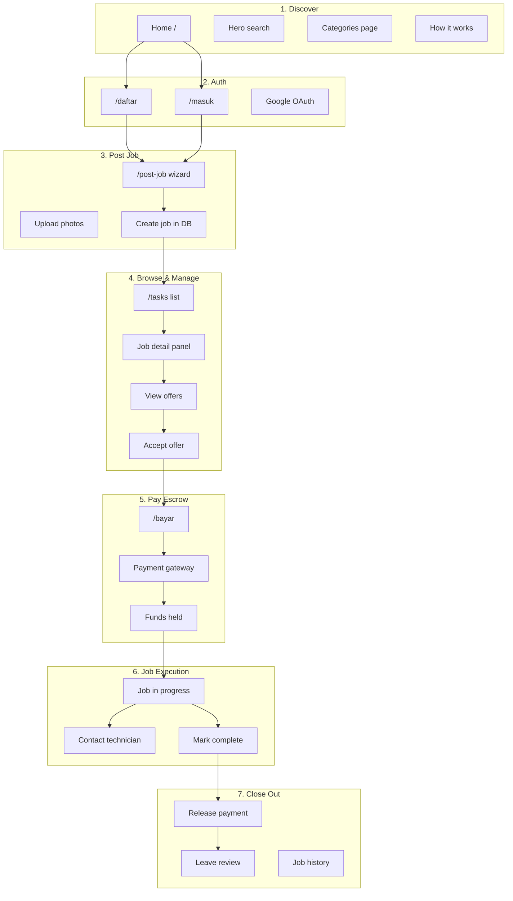
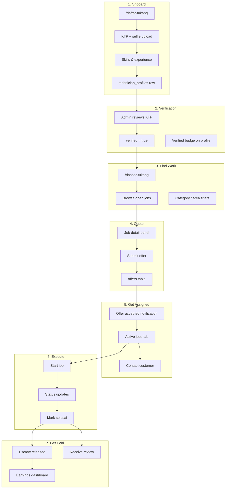

# KerjaIn — Completion Roadmap

A full checklist to take KerjaIn from **working prototype** to **production-ready marketplace**. Organized by end-to-end pipeline flows for **customers (pemilik pekerjaan)** and **technicians (tukang)**.

**Legend:** ✅ Done · 🟡 Partial · ❌ Not started

---

## Current State (as of June 2026)

| Layer | Status |
|-------|--------|
| Frontend UI | ✅ All major pages built (Figma export, Indonesian localization) |
| Express API (`backend/`) | 🟡 Core routes: auth, jobs, offers, technicians, payments |
| Supabase DB | 🟡 Tables exist: `users`, `oauth_accounts`, `refresh_tokens`, `technician_profiles`, `jobs`, `offers`, `payments` |
| Auth | ✅ | Email + Google OAuth, forgot/reset password, email verification, `/akun`; Facebook skipped |
| Customer dashboard | 🟡 | `/pekerjaan-saya` — job list by status; no edit/cancel yet |
| Payments | 🟡 Simulated — no real payment gateway |
| File uploads | ❌ Photos/KTP are placeholder strings |
| Messaging | ❌ No in-app chat |
| Reviews | ❌ No ratings system in DB |
| Notifications | ❌ UI badge only, no backend |
| Maps | ❌ Decorative SVG, not real geolocation |
| Admin | ❌ No admin panel |
| Deploy | ❌ Local dev only |

---

## Customer Pipeline (Pemilik Pekerjaan)



### Step-by-step checklist — Customer

#### 1. Discover & land
| # | Task | Status | Notes |
|---|------|--------|-------|
| 1.1 | Home page marketing content | ✅ | Static content, carousel, trust sections |
| 1.2 | Hero search → navigate to `/tasks` with query | ✅ | `?search=` param; Enter or Cari Tukang button |
| 1.3 | Service directory links | ✅ | Links to `/tasks?search=`; carousel cards searchable |
| 1.4 | Wire `/categories` route (or remove) | ✅ | Routed; nav link "Layanan" in header |
| 1.5 | Localize `Categories.tsx` to Indonesian + Jakarta | ✅ | Plumbing/handyman focus; Jakarta locations |
| 1.6 | Fix HowItWorks CTA → `/post-job` not `/tasks` | ✅ | Post CTAs → `/post-job`; browse → `/tasks` |
| 1.7 | Footer links (Tentang Kami, FAQ, Syarat, etc.) | ✅ | Real routes in `Root.tsx`; locations → `/tasks?area=` |
| 1.8 | SEO: meta tags, Open Graph, sitemap | ✅ | `index.html` Indonesian SEO; `public/sitemap.xml`, `robots.txt` |

#### 2. Register / login
| # | Task | Status | Notes |
|---|------|--------|-------|
| 2.1 | Email register (`POST /api/auth/register`) | ✅ | Role `user` |
| 2.2 | Email login (`POST /api/auth/login`) | ✅ | |
| 2.3 | JWT session + refresh token | ✅ | Stored in `localStorage` |
| 2.4 | Google OAuth | ✅ | `/auth/google` → `/auth/callback` |
| 2.5 | Facebook OAuth | ❌ | Code exists — skipped for now; needs Meta app credentials (see `docs/FACEBOOK_OAUTH_SETUP.md`) |
| 2.6 | Apple OAuth | — | Removed — not supported |
| 2.7 | Forgot password / reset email | ✅ | `/lupa-sandi`, `/atur-ulang-sandi`; Resend or dev console link |
| 2.8 | Email verification | ✅ | On register + `/verifikasi-email`; resend from `/akun` |
| 2.9 | Show logged-in state in header (`Root.tsx`) | ✅ | Avatar, name, account link when logged in |
| 2.10 | User profile / account settings page | ✅ | `/akun` — profile, change password, verification |
| 2.11 | Logout from header | ✅ | Keluar button in desktop + mobile nav |
| 2.12 | Verify with phone number | 🟡 | `users.phone` for customers; unique per role (same # OK on user + tukang accounts) |

#### 3. Post a job
| # | Task | Status | Notes |
|---|------|--------|-------|
| 3.1 | 6-step wizard UI | ✅ | Layanan → Deskripsi → Lokasi → Waktu → Anggaran → Tinjau |
| 3.2 | Auth guard on `/post-job` | ✅ | Redirects to `/masuk` |
| 3.3 | Persist job to DB (`POST /api/jobs`) | ✅ | |
| 3.4 | Real photo upload to Supabase Storage | ✅ | `POST /api/upload/job-photo` → `job-photos` bucket; uploads on submit |
| 3.5 | Image preview + delete before submit | ✅ | Local preview thumbnails in wizard + review step |
| 3.6 | Geocode address → lat/lng on job | ✅ | Nominatim + Jakarta area fallbacks; `jobs.latitude`/`longitude` migration |
| 3.7 | Success screen → link to live job on `/tasks?id=` | ✅ | Primary CTA opens posted job; uses real UUID |
| 3.8 | Share job link (copy/WhatsApp) | ✅ | Copy link + WhatsApp share with `/tasks?id=<uuid>` URL |
| 3.9 | Customer "My Jobs" dashboard | ✅ | `/pekerjaan-saya` — Semua / Aktif / Selesai tabs; header link; `api.getMyJobs()` |
| 3.10 | Edit / cancel open job | 🟡 | Cancel open jobs via `POST /api/jobs/:id/cancel` + My Jobs UI; edit not yet |
| 3.11 | Validation error messages from API | ✅ | `validateCreateJobBody` + `ApiError.details` surfaced in PostJob |

#### 4. Browse jobs & receive offers
| # | Task | Status | Notes |
|---|------|--------|-------|
| 4.1 | Job list from API (`GET /api/jobs`) | ✅ | |
| 4.2 | Search filter (title) | ✅ | Client + server |
| 4.3 | Location / price / sort filters | ❌ | UI only, no logic |
| 4.4 | Real map with job pins | ❌ | SVG placeholder |
| 4.5 | Job detail panel | ✅ | Detail / Penawaran / Pemilik tabs; `?id=` opens job from URL |
| 4.6 | Fetch offers for job (`GET /api/offers/job/:id`) | ✅ | |
| 4.7 | Accept offer (`POST /api/offers/:id/accept`) | ✅ | Updates job → `assigned` |
| 4.8 | Real-time new offer notifications | ❌ | No Supabase Realtime / push |
| 4.9 | Compare offers side-by-side | ❌ | |
| 4.10 | View technician profile before accepting | ❌ | Only name shown |
| 4.11 | Customer sees only their own jobs in a "My Jobs" view | ✅ | `/pekerjaan-saya` via `GET /api/jobs/mine`; `/tasks` still lists all open marketplace jobs |

#### 5. Pay (escrow)
| # | Task | Status | Notes |
|---|------|--------|-------|
| 5.1 | Payment page UI (e-wallet, VA, card) | ✅ | |
| 5.2 | Auth guard + `?jobId=&offerId=` params | ✅ | |
| 5.3 | Create payment record (`POST /api/payments`) | ✅ | Simulated |
| 5.4 | Integrate real gateway (Midtrans / Xendit) | ❌ | |
| 5.5 | Webhook for payment confirmation | ❌ | |
| 5.6 | VA payment confirm flow (`POST /api/payments/:id/confirm`) | 🟡 | API exists, UI doesn't call it |
| 5.7 | Credit card form → real charge | ❌ | `setTimeout` mock |
| 5.8 | Payment receipt / invoice PDF | ❌ | |
| 5.9 | Refund / dispute flow | ❌ | |
| 5.10 | Order summary uses live data | 🟡 | Loads from API if params present; sidebar still uses static `JOB` constant in subcomponents |

#### 6. Job in progress
| # | Task | Status | Notes |
|---|------|--------|-------|
| 6.1 | Job status `in_progress` after payment | 🟡 | Backend sets on payment success |
| 6.2 | Customer dashboard: active jobs | 🟡 | "Aktif" tab on `/pekerjaan-saya` (open / assigned / in_progress) |
| 6.3 | In-app messaging with technician | ❌ | "Hubungi" buttons have no handler |
| 6.4 | Schedule / reschedule appointment | ❌ | |
| 6.5 | Photo updates from technician on-site | ❌ | |
| 6.6 | Customer confirms job complete | ❌ | No API `POST /api/jobs/:id/complete` |
| 6.7 | Auto-release escrow after N days | ❌ | |

#### 7. Reviews & history
| # | Task | Status | Notes |
|---|------|--------|-------|
| 7.1 | `reviews` table in DB | ❌ | |
| 7.2 | Leave star rating + text review | ❌ | |
| 7.3 | Update technician `rating` / `review_count` | ❌ | Columns exist, never updated |
| 7.4 | Completed jobs history for customer | 🟡 | "Selesai" tab on `/pekerjaan-saya` (when jobs reach `completed` / `cancelled`) |
| 7.5 | Home page "completed tasks" carousel from real data | ❌ | Static mock |

---

## Technician Pipeline (Tukang)



### Step-by-step checklist — Technician

#### 1. Register as tukang
| # | Task | Status | Notes |
|---|------|--------|-------|
| 1.1 | 5-step wizard UI | ✅ | Akun → Profil → KTP → Keahlian → Pengalaman |
| 1.2 | Email register with `role: technician` | ✅ | |
| 1.3 | Google OAuth for technicians | 🟡 | OAuth creates `role: user` — needs role picker or separate flow |
| 1.4 | Save `technician_profiles` on submit | ✅ | |
| 1.5 | Real KTP + selfie upload to Storage | ❌ | `setTimeout` → `"uploaded"` string |
| 1.6 | NIK validation (16 digit) | ❌ | Field exists, no validation |
| 1.7 | Tarif selection UI | 🟡 | `TARIF_OPTIONS` defined, selection incomplete |
| 1.8 | Phone OTP verification | ❌ | |
| 1.9 | Auth guard on `/daftar-tukang` if already logged in | ❌ | |

#### 2. Verification
| # | Task | Status | Notes |
|---|------|--------|-------|
| 2.1 | `verified` flag on profile | 🟡 | Column exists, always `false` for new signups |
| 2.2 | Admin panel to review KTP submissions | ❌ | |
| 2.3 | Email notification when verified | ❌ | |
| 2.4 | Block quoting until verified (optional policy) | ❌ | |
| 2.5 | Verified badge on dashboard + offers | ❌ | |

#### 3. Browse jobs (Lowongan tab)
| # | Task | Status | Notes |
|---|------|--------|-------|
| 3.1 | Job feed from API | ✅ | |
| 3.2 | Category filter tabs | 🟡 | Filters local mock categories against API `category` field |
| 3.3 | Area-based filtering (match technician's area) | ❌ | |
| 3.4 | Hide jobs already quoted | 🟡 | `quotedJobs` local state only — resets on refresh |
| 3.5 | Persist quoted state from DB (`GET /api/offers/mine`) | ❌ | API exists, dashboard doesn't fetch |
| 3.6 | Job detail + description panel | ✅ | |
| 3.7 | Exclude own posted jobs (if user has both roles) | ✅ | `GET /api/jobs` filters own jobs for technicians; offers blocked on own jobs |

#### 4. Submit quote (Penawaran)
| # | Task | Status | Notes |
|---|------|--------|-------|
| 4.1 | Quote form UI (price, availability, message) | ✅ | |
| 4.2 | Submit offer (`POST /api/offers/job/:id`) | ✅ | |
| 4.3 | Duplicate offer prevention | ✅ | Unique `(job_id, technician_id)` |
| 4.4 | Edit / withdraw pending offer | ❌ | |
| 4.5 | "Penawaran Saya" tab from API | ❌ | Static `MY_OFFERS` mock data |
| 4.6 | Offer status updates (accepted/rejected) | ❌ | No realtime poll or push |

#### 5. Active jobs (Pekerjaan Aktif tab)
| # | Task | Status | Notes |
|---|------|--------|-------|
| 5.1 | List jobs where offer accepted + paid | ❌ | Static `ACTIVE_JOBS` mock |
| 5.2 | `GET /api/jobs?status=assigned&technician_id=me` | ❌ | Endpoint doesn't filter by technician |
| 5.3 | "Hubungi Pelanggan" messaging | ❌ | Button has no handler |
| 5.4 | Navigation to job address (maps link) | ❌ | |
| 5.5 | Mark job complete (`POST /api/jobs/:id/complete`) | ❌ | Button has no handler |
| 5.6 | Upload completion photos | ❌ | |

#### 6. Completed & earnings (Selesai tab)
| # | Task | Status | Notes |
|---|------|--------|-------|
| 6.1 | Completed jobs list | ❌ | Static mock |
| 6.2 | Earnings summary (`penghasilan` stat) | ❌ | Hardcoded `"Rp 4.2jt"` |
| 6.3 | Payout to bank account | ❌ | No `payouts` table |
| 6.4 | Download earnings report | ❌ | |
| 6.5 | Update `jobs_completed` counter | ❌ | |

#### 7. Technician profile & reputation
| # | Task | Status | Notes |
|---|------|--------|-------|
| 7.1 | Public technician profile page | ❌ | |
| 7.2 | Display reviews from customers | ❌ | |
| 7.3 | Edit profile after registration | ❌ | API exists (`POST /api/technicians/profile`), no UI |
| 7.4 | Availability calendar | ❌ | |
| 7.5 | Portfolio / past work photos | ❌ | |

---

## Shared / Platform Features

### Database tables still needed

| Table | Purpose |
|-------|---------|
| `reviews` | `job_id`, `reviewer_id`, `reviewee_id`, `rating`, `comment` |
| `messages` | In-app chat between customer and technician per job |
| `notifications` | In-app + push notification queue |
| `job_status_history` | Audit trail of status changes |
| `payouts` | Technician withdrawal requests |
| `disputes` | Payment / quality disputes |
| `saved_jobs` | Customer bookmarked jobs |

### Backend API gaps

| Endpoint | Purpose | Status |
|----------|---------|--------|
| `PATCH /api/jobs/:id` | Edit job | ❌ |
| `POST /api/jobs/:id/cancel` | Cancel job | ❌ |
| `POST /api/jobs/:id/complete` | Mark complete (customer or tech) | ❌ |
| `GET /api/jobs/mine` | Customer's jobs | ✅ | UI at `/pekerjaan-saya` |
| `GET /api/jobs/assigned` | Technician's active jobs | ❌ |
| `DELETE /api/offers/:id` | Withdraw offer | ❌ |
| `POST /api/upload` | Presigned URL for Storage | ❌ |
| `GET/POST /api/messages/:jobId` | Chat | ❌ |
| `GET /api/notifications` | Notification feed | ❌ |
| `POST /api/reviews` | Submit review | ❌ |
| `POST /api/auth/forgot-password` | Password reset | ✅ | `/lupa-sandi`, `/atur-ulang-sandi`; Resend or dev link |
| Webhook `/api/webhooks/midtrans` | Payment events | ❌ |

### Security & infrastructure

| # | Task | Status |
|---|------|--------|
| S1 | RLS policies if using Supabase client directly | ❌ | RLS enabled, no policies — backend bypasses via service role |
| S2 | Rate limiting on auth endpoints | ❌ |
| S3 | Input sanitization / validation (Zod on backend) | 🟡 | Minimal checks |
| S4 | CORS lock to production domain | 🟡 | Dev URL only |
| S5 | HTTPS in production | ❌ |
| S6 | Environment separation (staging/prod) | ❌ |
| S7 | Secrets in CI/CD, not committed | 🟡 | `.gitignore` added for `.env` |
| S8 | KTP documents bucket is private + signed URLs | 🟡 | Bucket created as private, no upload flow yet |

### Notifications

| Channel | Use case | Status |
|---------|----------|--------|
| In-app | New offer, offer accepted, payment received | ❌ |
| Email | Welcome, job posted, offer received, payment receipt | ❌ |
| WhatsApp / SMS | Urgent job alerts for technicians | ❌ |
| Push (PWA) | Mobile-like notifications | ❌ |

### Realtime

| Feature | Tech | Status |
|---------|------|--------|
| New offers appear without refresh | Supabase Realtime on `offers` | ❌ |
| Chat messages | Supabase Realtime on `messages` | ❌ |
| Job status updates | Realtime on `jobs` | ❌ |

---

## Page-by-Page Status

| Route | Page | Backend wired | Remaining work |
|-------|------|---------------|----------------|
| `/` | Home | 🟡 | Search, service links, footer wired; carousel still static |
| `/tasks` | Tasks | ✅ | `?id=` & `?search=` & `?area=`; filters, map still partial |
| `/post-job` | PostJob | ✅ | Photo upload, geocode, share link, validation errors |
| `/bayar` | Payment | 🟡 | Real gateway, fix static sidebar components |
| `/masuk` `/daftar` | Auth | ✅ | Google OAuth; forgot password; email verification |
| `/akun` | AccountSettings | ✅ | Profile, change password, resend verification |
| `/pekerjaan-saya` | MyJobs | ✅ | Customer job list — Semua / Aktif / Selesai |
| `/daftar-tukang` | TechAuth | ✅ | File upload, tarif UI, OAuth role fix |
| `/dasbor-tukang` | TechDashboard | 🟡 | Penawaran/Aktif/Selesai tabs from API, notifications |
| `/how-it-works` | HowItWorks | ✅ | CTAs → `/post-job` and `/tasks` |
| `/categories` | Categories | ✅ | Indonesian + Jakarta; links to task search |
| — | Technician profile | ❌ | New public page |
| — | Admin panel | ❌ | KTP verification, disputes, user management |

---

## Recommended Build Order

### Phase 1 — Complete the core loop (MVP)
> Customer posts → Technician quotes → Customer accepts → Pays → Job done

1. ~~Customer "My Jobs" page (`/pekerjaan-saya`) using `GET /api/jobs/mine`~~ ✅
2. Technician dashboard tabs wired to API (offers mine, assigned jobs, completed)
3. `POST /api/jobs/:id/complete` + escrow release logic
4. Real file upload (job photos + KTP) via Supabase Storage
5. ~~Header auth state (name, avatar, logout)~~ ✅
6. Fix Payment page to use `jobData`/`total` throughout (remove static `JOB`/`TOTAL`)

### Phase 2 — Trust & money
7. Midtrans or Xendit integration + webhooks
8. `reviews` table + post-job review flow
9. Technician public profile page
10. KTP admin verification workflow
11. Email notifications (Resend / SendGrid)

### Phase 3 — Discovery & growth
12. Real map (MapLibre + job coordinates)
13. Categories page routed + localized
14. Search with category + area filters
15. Home page dynamic content from DB
16. SEO + landing pages per service/area

### Phase 4 — Engagement
17. In-app messaging per job
18. Supabase Realtime for offers + chat
19. Push / WhatsApp notifications for urgent jobs
20. Technician availability + earnings/payouts

### Phase 5 — Production
21. Deploy frontend (Vercel/Netlify) + backend (Railway/Fly.io)
22. Custom domain + SSL
23. Error monitoring (Sentry)
24. Analytics (PostHog / GA)
25. Admin panel
26. Load testing + security audit

---

## End-to-End Happy Path Test Script

Use this to verify the full pipeline works after each phase:

### Customer
1. [ ] Register at `/daftar` with email
2. [x] Post job at `/post-job` (with real photo)
3. [ ] See job appear on `/tasks`
4. [ ] Receive notification when technician quotes
5. [ ] View offers on job detail → Penawaran tab
6. [ ] Accept an offer
7. [ ] Pay at `/bayar` (real or sandbox gateway)
8. [ ] See job move to "Aktif" in `/pekerjaan-saya` *(tab exists; needs assigned/paid job in DB)*
9. [ ] Message technician in-app
10. [ ] Confirm job complete
11. [ ] Leave a review
12. [ ] See payment receipt

### Technician
1. [ ] Register at `/daftar-tukang` (with KTP upload)
2. [ ] Get verified by admin
3. [ ] See open jobs on `/dasbor-tukang` → Lowongan
4. [ ] Submit quote on a job
5. [ ] Get notified when offer is accepted
6. [ ] See job in Pekerjaan Aktif tab
7. [ ] Message customer
8. [ ] Mark job selesai
9. [ ] See earnings update
10. [ ] Receive customer review on profile

---

## Files to Create (suggested)

```
src/app/pages/
  TechProfile.tsx         # Public technician profile
  Messages.tsx            # Chat per job

backend/src/routes/
  messages.ts
  reviews.ts
  notifications.ts
  upload.ts
  webhooks.ts

supabase/migrations/
  add_reviews.sql
  add_messages.sql
  add_notifications.sql
  add_job_coordinates.sql
  rls_policies.sql
```

### Recently shipped

| File | Route | Notes |
|------|-------|-------|
| `MyJobs.tsx` | `/pekerjaan-saya` | Customer job dashboard — Phase 1 step 1 |
| `AccountSettings.tsx` | `/akun` | Profile, password, email verification |
| `ForgotPassword.tsx` | `/lupa-sandi` | Password reset request |
| `ResetPassword.tsx` | `/atur-ulang-sandi` | Set new password from email link |
| `VerifyEmail.tsx` | `/verifikasi-email` | Email verification landing |

---

*Last updated: 25 June 2026 — My Jobs (`/pekerjaan-saya`), auth flows, Tasks `?id=` deep link.*
