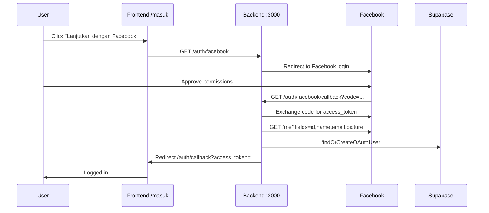

# Facebook Login Setup for KerjaIn

This guide walks you through connecting Facebook OAuth to KerjaIn. The code is already implemented — you only need to create a Meta app and add credentials to `.env`.

## How the flow works



---

## Step 1 — Create a Meta Developer account

1. Go to [developers.facebook.com](https://developers.facebook.com/)
2. Log in with your Facebook account
3. Accept the developer terms if prompted

---

## Step 2 — Create a Facebook App

1. Click **My Apps** → **Create App**
2. Choose use case: **Authenticate and request data from users with Facebook Login**  
   (or **Other** → **Consumer** if that option isn't shown)
3. App name: `KerjaIn` (or `KerjaIn Dev` for local testing)
4. Contact email: your email
5. Click **Create app**

---

## Step 3 — Add Facebook Login product

1. In the app dashboard, find **Add products**
2. Click **Set up** on **Facebook Login**
3. Choose platform: **Web**
4. Site URL: `http://localhost:5173` (for local dev)
5. Skip the quickstart wizard if you want — we'll configure manually

---

## Step 4 — Configure OAuth redirect URIs

1. Left sidebar: **Facebook Login** → **Settings**
2. Under **Valid OAuth Redirect URIs**, add:

   ```
   http://localhost:3000/auth/facebook/callback
   ```

3. For production, also add:

   ```
   https://your-api-domain.com/auth/facebook/callback
   ```

4. Click **Save Changes**

> **Important:** The redirect URI must match **exactly** what's in your `.env` (`FACEBOOK_REDIRECT_URI`). No trailing slash unless you add one everywhere.

---

## Step 5 — Get App ID and App Secret

1. Left sidebar: **App settings** → **Basic**
2. Copy **App ID** → this is `FACEBOOK_APP_ID`
3. Click **Show** next to **App Secret** → this is `FACEBOOK_APP_SECRET`

---

## Step 6 — Add credentials to `.env`

Add these lines to your project root `.env`:

```env
FACEBOOK_APP_ID=your_app_id_here
FACEBOOK_APP_SECRET=your_app_secret_here
FACEBOOK_REDIRECT_URI=http://localhost:3000/auth/facebook/callback
```

Restart the backend after saving:

```bash
cd backend && npm run dev
```

---

## Step 7 — Configure app for local testing

While your app is in **Development** mode, only these people can log in:

- App admins
- App developers
- App testers (add them in **App roles** → **Roles**)

### Add yourself as a tester

1. **App roles** → **Roles** → **Administrators** (you should already be here)
2. Or add a **Test User** / **Tester** under **Testers**

### Enable localhost (if needed)

1. **App settings** → **Basic**
2. Scroll to **App domains** and add: `localhost`
3. Under **Website**, ensure Site URL is `http://localhost:5173`

---

## Step 8 — Request `email` permission

Facebook Login requests `email` and `public_profile` scopes. The `email` field is required — KerjaIn uses it as the user account identifier.

- In **Development** mode, `email` works for admins/developers/testers without app review
- For **Live** mode (public users), you must submit **App Review** for the `email` permission:
  1. **App Review** → **Permissions and Features**
  2. Find `email` → **Request**
  3. Provide a screencast showing the login flow

If a user denies email or Facebook doesn't return it, they'll be redirected to:

```
/masuk?error=facebook_no_email
```

---

## Step 9 — Test the flow

1. Start backend: `cd backend && npm run dev`
2. Start frontend: `npm run dev`
3. Open [http://localhost:5173/masuk](http://localhost:5173/masuk)
4. Click **Lanjutkan dengan Facebook**
5. Approve permissions on Facebook
6. You should land back on KerjaIn, logged in

Verify in Supabase:

```sql
SELECT * FROM oauth_accounts WHERE provider = 'facebook';
SELECT * FROM users ORDER BY created_at DESC LIMIT 5;
```

---

## Troubleshooting

| Error | Cause | Fix |
|-------|-------|-----|
| `URL Blocked: This redirect failed` | Redirect URI not whitelisted | Add exact URI in Facebook Login → Settings |
| `Invalid OAuth access token` | Wrong App Secret or expired code | Double-check `.env`, try login again |
| `Facebook OAuth not configured` | Missing `FACEBOOK_APP_ID` | Add env vars, restart backend |
| `facebook_no_email` | User has no email on Facebook or denied permission | Use a Facebook account with verified email |
| `App Not Active` | App in Development, user not a tester | Add user as tester or switch app to Live |
| Login works but user has `role: user` when registering as tukang | OAuth always creates `user` role | Technician OAuth role picker is a separate roadmap item |

---

## Production checklist

- [ ] Switch app to **Live** mode in Meta dashboard
- [ ] Complete **App Review** for `email` permission
- [ ] Add production redirect URI to Facebook Login settings
- [ ] Set `FACEBOOK_REDIRECT_URI` to production API URL
- [ ] Add Privacy Policy URL in App settings → Basic (required for Live)
- [ ] Add Terms of Service URL
- [ ] Use HTTPS everywhere

---

## API endpoints (reference)

| Method | Path | Description |
|--------|------|-------------|
| GET | `/auth/facebook` | Starts Facebook OAuth redirect |
| GET | `/auth/facebook/callback` | Handles callback, creates session, redirects to frontend |

Frontend uses `api.oauthAuthUrl("facebook")` which points to `http://localhost:3000/auth/facebook`.
